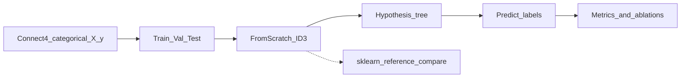

# ID3 Decision Tree (Option 1) — Notebook Implementation Outline

This document describes what the finished Python notebook should look like after implementation. It contains **no code**—only section structure, formulas by name, library rules, and evaluation design.

**Dataset:** [UCI Connect-4](https://archive.ics.uci.edu/dataset/26/connect+4) (Tromp, 1995)  
**Citation:** Tromp, J. (1995). Connect-4 [Dataset]. UCI Machine Learning Repository. https://doi.org/10.24432/C59P43.

---

## Scope and constraints (from A2 specification + FAQ)

- **Option focus:** Study and implement ID3 yourself. Option 1 requires algorithm implementation, not just use of libraries. Off-the-shelf scikit-learn / PyTorch / etc. must **not** implement the core algorithm.
- **Allowed tooling:** numpy, scipy, pandas, matplotlib for numerics, data I/O, and plots. Sorting, array ops, and random seeds are fine.
- **Reference only:** `sklearn.tree.DecisionTreeClassifier` (entropy criterion, matched depth where possible) may be used **only** to compare against your tree—not as the submitted model.
- **Deliverable shape:** One public Colab notebook (self-contained: setup, download data, preprocess, train, evaluate) plus a later journal PDF.
- **Chosen dataset:** Connect-4 — 42 categorical board-cell features (`x` / `o` / `b`), ~67,557 legal 8-ply positions, 3-class outcome for the first player: `{win, loss, draw}`. Pair with a **tiny Play-Tennis table** in-notebook for a transparent hand-check of entropy and information gain.

---

## Dataset facts to state in the notebook

| Property | Value |
|----------|--------|
| Domain | Connect-4 game positions (spatial / board) |
| Instances | Approximately 67,557 |
| Features | 42 categorical cells: `a1`–`a6`, `b1`–`b6`, …, `g1`–`g6` |
| Feature values | `x` (first player), `o` (second player), `b` (blank) |
| Target | `win`, `loss`, `draw` (game-theoretic value for first player) |
| Missing values | None |
| Board layout | Columns `a`–`g`, rows `1`–`6` (bottom to top) |

**ID3 fit:** All attributes are discrete with small arity (3 values), so classic multiway ID3 splits apply without continuous discretization.

**Scale note:** Full Connect-4 is large for a naive recursive ID3. The notebook should document a **defensible subsample or depth cap** for interactive Colab runs (e.g. stratified subsample for development, optional full-data run with `max_depth`), and justify that this is an experimental control—not a substitute for implementing the algorithm.

---

## Library policy checklist

| Situation | Allowed for Option 1? |
|-----------|------------------------|
| numpy, scipy, pandas, matplotlib | Yes |
| Matrix / array ops, sorting, RNG | Yes |
| scikit-learn or PyTorch **for your ID3 algorithm** | **No** |
| Existing libraries for basic sub-routines (not the tree) | Yes |
| sklearn tree **as reference comparison only** | Yes |
| Off-the-shelf split criterion (entropy/IG library) for the main path | **No** — implementing entropy/IG is the Option 1 learning core |
| AI assistance while building/debugging | Yes (document in journal) |
| AI-generated text/code you cannot explain | No |

---

## Finished notebook — section outline

### 0. Title, metadata, environment

- Project title: study and implementation of ID3 for Connect-4 outcome classification (Option 1).
- Student name / ID placeholders.
- Environment setup limited to allowed libraries; sklearn installed **only** for the reference-comparison section.
- Fixed random seed and a short reproducibility statement.

---

### 1. Problem definition (Criterion A — Task I/O)

Markdown at **Clear** level:

- **Task:** Multi-class classification of the game-theoretic outcome for the first player given a legal 8-ply Connect-4 board (neither player has already won; next move not forced).
- **Training I/O:**
  - **Input:** A row of 42 categorical features, each in `{x, o, b}`, representing cells `a1`…`g6`.
  - **Output:** Discrete label in `{win, loss, draw}`.
- **Deployment I/O:**
  - **Input:** Same 42-cell schema for one board (or a batch of boards).
  - **Output:** Predicted class label; optionally leaf class frequencies as a simple confidence / distribution.
- **Motivation (Option 1 historical angle):** Quinlan’s ID3 and information-theoretic splitting; hypothesis space of symbolic decision trees; why discrete attribute–value learning was studied for structured domains such as games before continuous parametric models dominated.
- **Research-leaning question (example):** How does greedy information-gain splitting on board-cell attributes behave under class imbalance and attribute noise, relative to a majority-class baseline and an entropy-based sklearn tree with matched depth limits?

---

### 2. Learning-theory framing (Option 1 depth)

- **Hypothesis space \(H\):** Finite set of decision trees over the 42 categorical cell attributes (axis-aligned symbolic partitions). Not parametrized by a continuous weight vector \(\theta\).
- **Training ≠ gradient descent:** Induction selects one \(h \in H\) by recursive information-gain maximization (greedy search), not iterative optimizer updates.
- **Surrogate vs task objective:** Training uses information gain (reduce conditional entropy of \(Y\) given a split). Evaluation uses 0–1 accuracy, macro-F1, and confusion structure. Document this mismatch explicitly (Criterion C).

---

### 3. Data acquisition and preprocessing (self-contained)

- Download / fetch Connect-4 inside the notebook (UCI archive or `ucimlrepo` id=26). Prefer a method that does not hide the schema.
- Load with pandas; name columns `a1`…`g6` plus `class` if needed.
- Verify all feature dtypes are categorical / string with values in `{x, o, b}`; target in `{win, loss, draw}`.
- Class-distribution table and a brief note on imbalance (typically many more `win` than `draw`/`loss`)—no heavy EDA slideshow.
- **Assumptions stated:** discrete features; no missing values; classic ID3 uses each attribute at most once on a path; positions are i.i.d. for this study (even though real play is sequential—state that as a modelling choice).
- Encoding for **your** tree: keep `x`/`o`/`b` as labels you control, or map to integer codes you document. Do not rely on sklearn preprocessing for the core pipeline.
- **Scale handling:** Document stratified subsample size (if used) and/or `max_depth` / `min_samples` caps so Colab remains runnable; report whether final metrics are on the subsample or full test set.
- Stratified **train / validation / test** split (e.g. 60/20/20): rows treated as i.i.d. positions → stratified random split is appropriate (FAQ reliability guidance). No temporal split unless you redefine the task.

---

### 4. Pedagogical mini-dataset (theory-to-code warm-up)

- Embed the classic Play-Tennis (or similar) ~14-row table.
- In markdown: compute root entropy and information gain for one attribute by hand (formulas written out).
- Run the **same** entropy / information-gain routines on this table and show numerical agreement—first explicit **math ↔ implementation** checkpoint before Connect-4 scale.

---

### 5. Core algorithm — formulas then functions (Criterion B)

Each mathematical object gets a markdown formula block, then a named notebook artifact the report can point to:

| Theory | Notebook artifact (name only) |
|--------|-------------------------------|
| Class entropy \(H(S)\) | `entropy` |
| Information gain \(IG(S,A)\) | `information_gain` |
| Best attribute \(\arg\max_A IG\) | `best_split` |
| Recursive ID3 induction | `id3_train` (returns tree structure) |
| Inference / traversal | `predict_one` / `predict` |
| Leaf policy | Majority class (tie-breaking rule documented) |

**Implementation rules for this section:**

- Own recursion and node data structures; no library `DecisionTreeClassifier.fit` for the main model.
- Stopping rules made explicit: pure node; no attributes left; empty subset; optional `max_depth` / `min_samples_leaf` as **your** hyperparameters (regularization of \(H\)).
- Narrative cells map each non-trivial step back to the formulas (required for presentation Q&A and FAQ “point to every symbol”).

**Connect-4-specific notes to discuss:**

- Each split is **multiway** over `{x, o, b}` (up to three children), unlike sklearn’s default binary CART-style splits.
- With 42 attributes, unrestricted trees can become very large—depth and min-sample stops are part of the study, not an afterthought.

---

### 6. System overview

One pipeline figure or bullet list:

load Connect-4 → (optional stratified subsample) → train/val/test split → `id3_train` on train → tune stopping on validation → freeze → evaluate on test → deploy `predict`.

---

### 7. Training and hyperparameters

- Fit the tree on the training set; report tree size (node count, depth), which attributes appear near the root (often informative for board games).
- Validation sweep over a small grid of `{max_depth, min_samples_leaf}`: plot or table train vs validation accuracy to illustrate overfitting as depth grows.
- Select configuration on validation only; perform **one** final evaluation on the held-out test set.

---

### 8. Evaluation (Criterion C)

- Metrics: accuracy, macro-F1, per-class precision/recall, confusion matrix (matplotlib heatmap).
- **Baseline:** majority-class classifier on the same splits; report whether ID3 beats it (a failure vs baseline is still a valid finding).
- Train vs test gap discussion (deep trees on discrete boards).
- **Loss vs objective write-up:** Information gain is a *splitting criterion*, not a sample-wise differentiable loss. The ideal task comparison is 0–1 / F1 on held-out boards—state where each is used.
- Subgroup / slice analysis: performance by class (`win` / `loss` / `draw`); optionally slice by a board property (e.g. number of blank cells, or occupancy of center column `d`) so aggregate accuracy does not hide failures.
- Optional multi-seed or repeated stratified splits to report variation (mean ± spread), not a single point estimate.

---

### 9. Reference comparison (FAQ-encouraged)

- Fit an entropy-based sklearn decision tree with settings as close as possible (depth, min samples).
- Side-by-side metrics and disagreement rate on the same test boards.
- Markdown accounting for gaps: multiway ID3 vs binary CART splits; feature reuse; pruning; categorical handling; tie-breaking—honest explanation of differences, not “sklearn is better.”

---

### 10. Depth experiments (avoid the “safe middle”)

About four deep probes (depth over breadth):

1. **Break information gain:** replace best-attribute selection with random attribute choice; predict collapse toward the majority baseline; verify.
2. **Assumption violation:** inject label noise and/or a constant (zero-information) feature; show near-zero IG for the constant feature and degraded generalization under noise.
3. **Complexity:** time induction versus number of samples \(n\) and attributes \(d\); state expected cost of evaluating one split on the order of \(O(n \cdot d \cdot C)\) with small \(C\) (categories per attribute); plot measured runtime on Connect-4 subsamples of increasing size.
4. **Failure mode:** attribute exhaustion before purity, contradictory labels on identical boards (if constructed), or unseen category at prediction time; show leaf majority behaviour and error.

---

### 11. Deployment sketch

- Single-board prediction demo with Clear I/O: 42 cells in → `{win, loss, draw}` out.
- Policy for out-of-vocabulary or malformed cells (reject vs map to an “unknown” / majority leaf)—describe even if the policy is simple.
- Optional note on latency: time per prediction vs any informal budget for interactive use.

---

### 12. Reflection and journal hooks

- **Limitations:** greedy myopia; treating spatial board structure as a flat attribute list (no explicit geometry); instability of deep trees; scale of full Connect-4.
- **Future work:** C4.5 / gain ratio; pruning; continuous features via discretization (not needed here); ensembles; features that encode threats / connect patterns instead of raw cells.
- **Implementation log prompts:** AI tool usage and critical review; challenges (multiway splits, empty branches, Colab memory/time on 42 features); knowledge gaps and how they were verified (Play-Tennis hand check, disagreement analysis vs sklearn).

---

### 13. Optional appendix

- Export tree structure (e.g. JSON) and a textual tree printout suitable for figures in the A2 journal PDF.
- Record Colab public URL placeholder for the journal’s “Link to Implementation” section.

---

## Mapping outline → A2 rubrics

| Criterion | Covered by notebook sections |
|-----------|------------------------------|
| **A** Task definition | §1 Clear I/O, historical motivation, research question; Connect-4 schema |
| **B** Model / algorithm | §2, §5–§7 theory-to-code mapping, recursive ID3, hyperparameters |
| **C** Evaluation / refinement | §8–§10 expected behaviour, IG vs 0–1 objective, baselines, ablations, failure analysis |

---

## Suggested build order (when writing the actual notebook later)

1. Data load + Clear I/O markdown + Play-Tennis hand check.
2. Entropy, information gain, and best-split routines with assertions against the mini-dataset.
3. Recursive train and predict.
4. Connect-4 stratified splits, metrics, majority baseline (with documented subsample/depth policy).
5. Ablations, sklearn reference comparison, complexity timing.
6. Polish narrative cells for the journal and presentation; publish Colab publicly.

---

## What this outline intentionally excludes

- No Python source, pseudocode listings, or copy-pasteable implementations (per assessment outline request).
- No Option 2-style “fit library and report accuracy only” path.
- No heavy exploratory data analysis as presentation content (spec warning).
