# Study and Implementation of ID3 for Connect-4 Outcome Classification

**32513 Advanced Data Analytics Algorithms — Assessment Task 2 (Option 1: study a fundamental ML model)**

| Field | Value |
|-------|-------|
| Student name | *[Your name]* |
| Student ID | *[Your student ID]* |
| Year | 2026 |
| Submission file | `STUDENTNAME_STUDENTID_2026_UTS_ML_Journal.pdf` |
| Dataset | UCI Connect-4 (Tromp, 1995), 67,557 legal 8-ply positions |
| Model | ID3 decision tree, implemented from scratch (numpy / pandas only) |

**Abstract.** This project studies Quinlan's ID3 algorithm and implements it from scratch to predict the game-theoretic outcome (`win`, `loss`, `draw` for the first player) of a Connect-4 board from its 42 raw cell values. Entropy, information gain, greedy attribute selection, multiway recursive induction and tree traversal are written by hand; scikit-learn appears only as a reference comparison. With stopping rules chosen on a validation set (`max_depth=8`, `min_samples_leaf=20`), the tree reaches 0.710 test accuracy and 0.498 macro-F1 on an 8,000-board stratified subsample, against 0.658 and 0.265 for a majority-class baseline; refitting on the full dataset with the same stops gives 0.753 and 0.543. The tree beats a depth-matched scikit-learn entropy tree (0.681 / 0.438) but almost never predicts `draw` correctly (recall 0.085). Four probes (random splits, label noise and a constant feature, runtime scaling, unseen values) are used to test whether the implementation behaves as the theory predicts. The main finding is a concrete mismatch between the training criterion (information gain) and the task objective (correct outcome per class): entropy reduction is dominated by the majority class, so the minority `draw` class is effectively never learned.

---

## 1. Link to Implementation

Public Google Colab notebook (plain-text URL, required):

`https://colab.research.google.com/drive/YOUR_NOTEBOOK_ID`  *[replace after publishing: Share → Anyone with the link → Viewer]*

Source repository (backup, same notebook): `https://github.com/swapnil-chhatre/Adv_Data_Analytics_Algo`

The notebook `id3_connect4.ipynb` is self-contained: it installs the allowed libraries, downloads Connect-4 through `ucimlrepo` (dataset id 26), preprocesses and splits the data, trains, evaluates, runs the probes and exports the tree. All results in this report come from one "Run all" with `RANDOM_SEED = 42` (numpy 2.4.4, pandas 3.0.2). A different pandas version may sample slightly different rows, so figures can move in the third decimal place.

---

## 2. Project Report

### 2.1 Problem Definition (Criterion A)

#### 2.1.1 The task

Given a legal Connect-4 position after exactly 8 plies (4 discs per player, neither player has already won, and the next move is not forced), predict its **game-theoretic value for the first player** under perfect play: `win`, `loss` or `draw`. This is a 3-class classification problem over 42 categorical attributes.

The board has 7 columns (`a`–`g`) and 6 rows (`1` at the bottom to `6` at the top). Each cell is named by column then row, and holds `x` (first player), `o` (second player) or `b` (blank):

```text
  6  a6 b6 c6 d6 e6 f6 g6
  5  a5 b5 c5 d5 e5 f5 g5
  4  a4 b4 c4 d4 e4 f4 g4
  3  a3 b3 c3 d3 e3 f3 g3
  2  a2 b2 c2 d2 e2 f2 g2
  1  a1 b1 c1 d1 e1 f1 g1
     a  b  c  d  e  f  g
```

#### 2.1.2 Input and output specification

| | OK level | Clear level (this project) |
|---|---|---|
| **Training input** | A table of 42 categorical columns `a1`…`g6`, values in `{x, o, b}`. | [OK] + Each row is one board from the UCI Connect-4 database (Tromp, 1995): all 67,557 legal 8-ply positions in which neither player has won and the next move is not forced. Every row has exactly four `x` and four `o`, and gravity holds (no disc sits above a blank). There are no missing values. Values are kept as strings; no numeric encoding is applied for our tree. Rows are treated as independent samples (a modelling choice; real positions come from sequential play). An 8,000-row stratified subsample is used for the main study; the full table is used for a scale check. |
| **Training output (label)** | One of `{win, loss, draw}`. | [OK] + The label is the exact game-theoretic value for the first player (`x`) with perfect play from both sides, computed by exhaustive search, so labels are noise-free. Classes are imbalanced: 65.8% `win`, 24.6% `loss`, 9.5% `draw`. |
| **Deployment input** | One board as 42 cell values in `{x, o, b}`. | [OK] + Same column names and alphabet as training, passed as one pandas row (`predict_one`) or a batch (`predict`). The model is only valid for 8-ply positions; it does **not** check legality, ply count or gravity, so a board from another stage of the game will still receive a prediction that has no guarantee. A cell value outside `{x, o, b}` is not rejected: traversal stops at the node that tests that cell and returns that node's majority class. |
| **Deployment output** | A predicted label in `{win, loss, draw}`. | [OK] + The label is the majority class of the leaf reached by following the board's cell values from the root. The leaf also stores its sample count `n` and entropy `H`, which can be read as a rough confidence (a leaf with `H` near 0 is pure; `H` near $\log_2 3 \approx 1.585$ is uninformative). Class-frequency vectors are not stored in the current implementation. |

A third party can test a solution against this specification: feed any row of the UCI table and check that the output is one of the three labels, and compare predictions with the database's labels on held-out rows.

#### 2.1.3 Motivation and historical context

**Why ID3.** Decision-tree induction grew out of Hunt, Marin and Stone's Concept Learning System (1966), which built classification trees by recursively partitioning examples. Quinlan's ID3 (1979, 1986) added the key idea studied here: choose each split by **information gain**, the reduction in Shannon (1948) entropy of the class label. Quinlan developed ID3 on exactly this kind of problem, classifying chess end-game positions as won or lost from board attributes, because exhaustive search results were available as labels but a compact, human-readable rule set was not. ID3 was later extended into C4.5 (Quinlan, 1993), and the parallel CART work (Breiman et al., 1984) produced the binary trees used by scikit-learn today.

**Why Connect-4.** Connect-4 was solved independently by Allis and by Allen in 1988: the first player wins with perfect play. Tromp's 1995 database records the solved value of every legal 8-ply position. This makes it a close modern analogue of Quinlan's original chess setting:

- all attributes are discrete with a small alphabet (`{x, o, b}`), so classic multiway ID3 applies without any discretisation;
- the labels are exact, so errors come from the model and not from label noise;
- the "traditional" solution is a game-tree search that may have to look up to 34 further plies ahead from each position. The learning question is whether a compact symbolic function of the **current** cells can approximate that search result.

**Why this is hard for ID3.** The value of a position depends on multi-cell patterns (threats of three-in-a-row, parity of empty squares in a column), but ID3 tests one cell at a time and each test on its own carries very little information: the root split gains only 0.026 bits out of 1.22. The tree has to build up patterns through long conjunctions of single-cell tests, while class imbalance means most of the entropy reduction is available by separating `win` from the rest.

#### 2.1.4 Research question

> How well does greedy information-gain splitting on raw board-cell attributes recover the solved value of Connect-4 positions, and specifically, does it learn the minority `draw` class, when compared with a majority-class baseline and with an entropy-based binary tree (scikit-learn) at the same depth limit?

The question is answerable with the data (exact labels, fixed schema) and connects to the loss-versus-objective discussion in Criterion C: information gain rewards any reduction of label uncertainty, weighted by sample count, so we expect it to favour the majority class.

### 2.2 Machine Learning Approach (Criterion B)

#### 2.2.1 Choice of model and justification

ID3 was chosen because it matches the data exactly and is small enough to implement and verify completely by hand:

- **Data–model alignment.** Every attribute is categorical with arity 3. ID3's multiway split creates one child per value, so one test answers the natural question "who owns this cell: first player, second player, or nobody?". No encoding or threshold search is needed, and no artificial order is imposed on `{x, o, b}`.
- **Interpretability.** Every prediction is a readable conjunction of cell tests (for example "`d1 = x` and `c3 = b` and …"), which is how Quinlan motivated ID3 for game positions.
- **Learning-theory content.** ID3 has no parameter vector and no gradient, so it is a clean contrast to the gradient-based models in the subject: the hypothesis space, the search procedure and the criterion are all discrete and can be stated exactly.

Alternatives considered: C4.5's gain ratio corrects ID3's bias towards attributes with many values, but all attributes here have the same arity, so the correction would change little. CART (binary splits) is used as the reference comparison in §2.3.5 instead of as the main model, because binary splits on integer-coded cells require an ordering we do not believe in.

#### 2.2.2 Learning-theory framing: hypothesis, criterion, search

| Framework component | ID3 on Connect-4 |
|---|---|
| **Input space** $X$ | $\{x, o, b\}^{42}$ (the 8-ply subset actually observed has 67,557 points). |
| **Output space** $Y$ | $\{\text{win}, \text{loss}, \text{draw}\}$. |
| **Hypothesis space** $H$ | All multiway decision trees whose internal nodes test one cell and branch on its observed values, with a class label at each leaf, and with each cell tested at most once per root-to-leaf path. Unrestricted, $H$ can represent **any** function of the 42 cells (it is a complete hypothesis space for discrete functions, Mitchell 1997, §3.6). `max_depth = D` restricts $H$ to trees with at most $3^D$ leaves (6,561 for $D = 8$). $H$ is **not** parametrised by a continuous vector $\theta$; a hypothesis is a discrete structure. |
| **Training criterion** | Information gain at each node (below). There is no global loss function that the whole tree minimises. |
| **Search / "optimiser"** | Greedy, top-down hill climbing with no backtracking: at each node, evaluate every remaining attribute, keep the one with the highest gain, partition, recurse. There is no learning rate, no iteration count and no gradient. |
| **Inductive bias** | Preference for trees that place high-gain attributes near the root, which approximately favours shorter trees (Mitchell 1997, §3.6). Stopping rules add an explicit preference for small trees. |
| **Evaluation criteria** | 0–1 accuracy, per-class precision/recall/F1, macro-F1 and the confusion matrix on held-out boards. These are **not** what the search optimises (see §2.4.2). |

**Entropy** of the class label over a sample set $S$, where $p_c = |S_c| / |S|$ is the fraction of $S$ with class $c$:

$$
H(S) = -\sum_{c \in Y} p_c \log_2 p_c
$$

**Information gain** of splitting $S$ on attribute $A$, where $S_v = \{s \in S : A(s) = v\}$:

$$
IG(S, A) = H(S) - \underbrace{\sum_{v \in \text{values}(A)} \frac{|S_v|}{|S|} H(S_v)}_{\text{remainder } H(S \mid A)}
$$

**Greedy choice** among the remaining attributes $\mathcal{A}$:

$$
A^* = \arg\max_{A \in \mathcal{A}} IG(S, A)
$$

**Leaf label** (and the node's fallback label): $\hat{y}(S) = \arg\max_{c} |S_c|$.

Information gain is the mutual information $I(Y; A)$ estimated on $S$: it measures how many bits of uncertainty about the outcome are removed by learning one cell's value. The weighting $|S_v| / |S|$ is what makes the criterion favour large, majority-class subsets, which becomes important in the evaluation.

#### 2.2.3 System overview

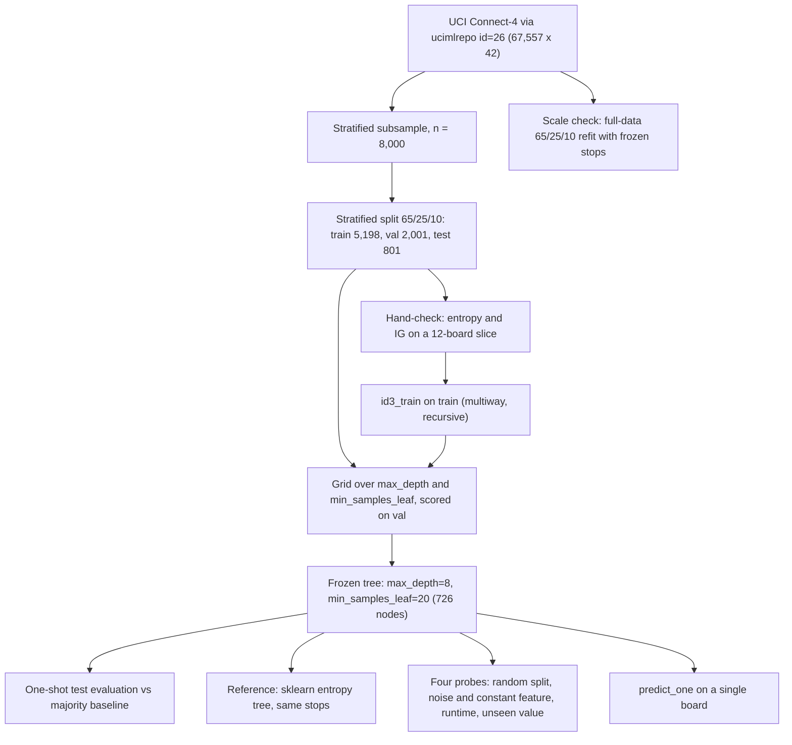

Data flows one way: hyperparameters are chosen on validation only, the test set is scored once, and the full-data refit reuses the frozen stops instead of retuning.

#### 2.2.4 Theory-to-code mapping

All core functions are in notebook §4 (`entropy`, `information_gain`) and §5 (`majority_label`, `best_split`, `id3_train`, `predict_one`, `predict`). No library performs any step of the algorithm.

| Mathematics | Code | Why the line is there |
|---|---|---|
| $p_c = \lvert S_c\rvert / \lvert S\rvert$ | `p = pd.Series(y).value_counts(normalize=True)` in `entropy` | Counts each class and divides by $\lvert S\rvert$. Only classes that occur are returned, so $0 \log 0$ is never evaluated and no epsilon is needed. |
| $H(S) = -\sum_c p_c \log_2 p_c$ | `return float(-(p * np.log2(p)).sum())` | Base 2 gives bits, so a uniform 3-class node has $H = \log_2 3 = 1.585$. A pure node prints as `-0.0000` because a zero sum is negated; this is a floating-point sign, not an error. |
| $\sum_v \frac{\lvert S_v\rvert}{\lvert S\rvert} H(S_v)$ | `rem = sum(len(g) / len(y) * entropy(g) for _, g in y.groupby(col))` in `information_gain` | `groupby(col)` forms each $S_v$ from the attribute column; `len(g)/len(y)` is the weight. |
| $IG = H(S) - H(S \mid A)$ | `return entropy(y) - rem` | |
| $A^* = \arg\max_A IG(S,A)$ | loop in `best_split` with `if ig > best_ig` | Strict `>` means ties go to the first attribute in column order (`a1`, `a2`, …). |
| Partition into $S_v$ | `for v, part in X.groupby(attr):` in `id3_train` | Only **observed** values create children, so there are never empty subsets to handle at training time. |
| Remove $A^*$ from $\mathcal{A}$ | `rest = [a for a in attributes if a != attr]` | Classic ID3 uses each attribute once per path. With a multiway split, $A^*$ is constant inside every child, so its gain there would be 0 anyway; removing it saves computation rather than changing the result. |
| Recursion | `children[v] = id3_train(part, y.loc[part.index], rest, ..., depth=depth + 1)` | Builds the nested-dict tree `{"attr", "children", "default", "n", "entropy", "ig"}`. |
| Stop: pure node | `if y.nunique() == 1: return {"leaf": y.iloc[0], ...}` | $H(S) = 0$; nothing left to learn. |
| Stop: no attributes | `len(attributes) == 0` | Depth 42 would be needed to reach it; unreachable with `max_depth = 8`. |
| Stop: too few samples | `len(y) < min_samples_leaf` | Regularises $H$. Note: this makes a node a leaf if it has **fewer than** `min_samples_leaf` rows, i.e. it acts as a *minimum samples to split* rule; children of a split can still be smaller (see §3.3). |
| Stop: depth cap | `max_depth is not None and depth >= max_depth` | Regularises $H$ to at most $3^D$ leaves. |
| Stop: no gain | `if ig <= 0: return {"leaf": default, ...}` | Splitting on a zero-gain attribute cannot reduce entropy (e.g. a constant column, Probe 2). |
| $\hat{y}(S) = \arg\max_c \lvert S_c\rvert$ | `majority_label(y)`: `pd.Series(y).value_counts().idxmax()` | Used for leaves and stored as `default` at every internal node. |
| $h(\mathbf{x})$: follow tests to a leaf | `predict_one`: `while "leaf" not in node: child = node["children"].get(row[node["attr"]])` | `.get` returns `None` for a value never seen at that node, in which case the node's `default` is returned. This is the deployment policy for unseen values. |

**Hand verification.** Before growing a full tree, the notebook draws a 12-board slice (4 per class, `MINI_SEED = 11`) and computes entropy and gain for cell `g1` on paper:

| `g1` | win | loss | draw | $n_v$ | $H(S_v)$ |
|---|---|---|---|---|---|
| `b` | 2 | 1 | 0 | 3 | 0.918 |
| `o` | 1 | 2 | 4 | 7 | 1.379 |
| `x` | 1 | 1 | 0 | 2 | 1.000 |

$$
H(S) = \log_2 3 = 1.585, \quad H(S \mid g1) = \tfrac{3}{12}(0.918) + \tfrac{7}{12}(1.379) + \tfrac{2}{12}(1) = 1.201, \quad IG = 0.384
$$

The notebook asserts that `entropy` and `information_gain` return 1.585 and 0.384 for this slice. On the same 12 boards, `id3_train` with `max_depth=4` fits all 12 correctly with root `a1` (IG 0.793), which is expected: a tree with enough depth can memorise 12 points.

#### 2.2.5 Training procedure and hyperparameters

There is no optimiser in the gradient sense; "training" is one recursive call of `id3_train` on the training set, and the only hyperparameters are the stopping rules.

| Choice | Value | Reason |
|---|---|---|
| Subsample for the main study | 8,000 rows, stratified by class | The pure-pandas implementation takes about 20 s per fit at 4,000 rows and 105 s on the full 40,533-row training set. A grid of 8 fits on the full data would take up to about 14 minutes per run; the subsample keeps the whole notebook runnable while preserving class proportions. The full data is still used once, as a scale check. |
| Split | Stratified 60 / 20 / 20 (train 4,799 / val 1,600 / test 1,601) | Rows are independent positions with no time order or grouping, so a stratified random split matches how the model would be used (FAQ reliability guidance). Stratification keeps the 9.5% `draw` class represented in every split. |
| Grid | `max_depth` $\in \{2, 4, 6, 8\}$ $\times$ `min_samples_leaf` $\in \{5, 20\}$ | Spans under-fitting (13 nodes) to clear over-fitting (1,331 nodes). |
| Selection rule | Highest validation accuracy | Test data is never seen during selection. |
| Chosen | `max_depth = 8`, `min_samples_leaf = 20` | Validation accuracy 0.718; 668 nodes; root `d1`. |
| Seed | `RANDOM_SEED = 42` for every sampling step | Reproducibility. ID3 itself is deterministic given the data. |

#### 2.2.6 Evaluation metrics and their relevance

| Metric | Why it is used here |
|---|---|
| **Accuracy** | The direct task objective: the fraction of positions whose solved value is predicted correctly. On its own it is misleading, because always answering `win` already scores 0.658. |
| **Majority-class baseline** | The "incumbent" a model has to beat (FAQ feasibility guidance). Any accuracy must be read relative to 0.658. |
| **Per-class precision, recall, F1** | Shows whether each outcome is actually learned. In game terms, confusing a `draw` with a `win` and confusing a `loss` with a `win` are different mistakes, and accuracy hides both behind the large `win` class. |
| **Macro-F1** | The unweighted mean of per-class F1, so the 9.5% `draw` class counts as much as `win`. The baseline scores 0.265 because it has F1 = 0 on two classes. |
| **Confusion matrix** | Shows the direction of errors (e.g. true `draw` predicted as `win`). |
| **Train vs validation vs test gap** | Detects over-fitting as $H$ grows. |

AUC-style metrics are not used because the tree outputs hard labels from majority leaves; it does not store class-probability vectors, so there is no ranking score to threshold.

### 2.3 Results

All numbers are from one run with `RANDOM_SEED = 42`. Figures are exported from the notebook into `figures/`.

#### 2.3.1 Data and splits

| | win | loss | draw | total |
|---|---|---|---|---|
| Full UCI table | 44,473 (65.8%) | 16,635 (24.6%) | 6,449 (9.5%) | 67,557 |
| Stratified subsample | 5,266 | 1,970 | 764 | 8,000 |
| Train | 3,159 | 1,182 | 458 | 4,799 |
| Validation | 1,053 | 394 | 153 | 1,600 |
| Test | 1,054 | 394 | 153 | 1,601 |

Class proportions are preserved in every split. The only data exploration kept is what the model needs: the class imbalance (which sets the baseline) and board occupancy. After 8 plies the bottom row is occupied in roughly 40–80% of boards (most often in columns b–c), row 2 in about 20–45%, and rows 5–6 are almost always blank. Cells that are nearly always blank carry almost no information, so in practice ID3 is choosing among the lower cells.

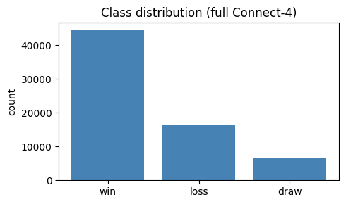

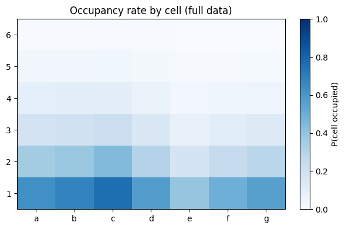

#### 2.3.2 Hyperparameter selection on validation

| `max_depth` | `min_samples_leaf` | train acc | val acc | nodes |
|---|---|---|---|---|
| 2 | 5 | 0.671 | 0.669 | 13 |
| 2 | 20 | 0.671 | 0.669 | 13 |
| 4 | 5 | 0.718 | 0.700 | 113 |
| 4 | 20 | 0.718 | 0.700 | 113 |
| 6 | 5 | 0.786 | 0.713 | 579 |
| 6 | 20 | 0.772 | 0.718 | 420 |
| 8 | 5 | **0.860** | 0.713 | 1,331 |
| 8 | 20 | 0.795 | **0.718** | 668 |

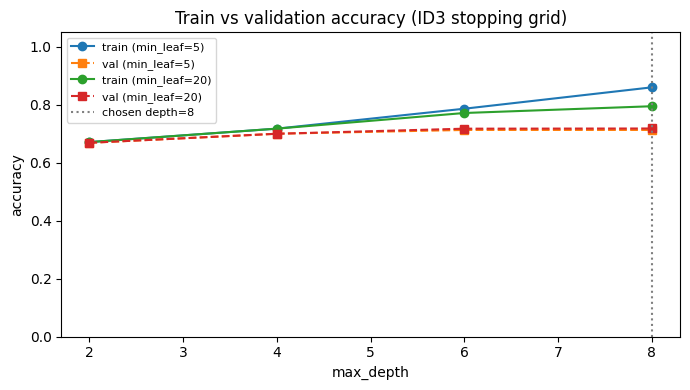

- Up to depth 4 train and validation accuracy rise together and `min_samples_leaf` has no effect (no node that deep is small enough to trigger it).
- From depth 6 the train–validation gap opens. With `min_samples_leaf = 5` at depth 8 the tree has 1,331 nodes and 0.860 training accuracy but no validation gain: extra nodes are memorising the training set.
- `min_samples_leaf = 20` halves the tree (668 nodes) at the same depth and keeps validation accuracy at its best. This is the regularisation effect of shrinking $H$.
- The selected setting (depth 8, min 20, val 0.718125) beats depth 6, min 20 (val 0.7175) by **one validation board** out of 1,600. The selection is effectively a tie; a simplicity rule would have picked the 420-node tree (see §2.4.3).

The root attribute is `d1`, the bottom cell of the centre column, in every configuration. Its gain is only 0.026 bits out of a root entropy of 1.219 bits, so even the best single cell is weakly informative.

#### 2.3.3 Test-set evaluation (subsample, frozen tree)

| | Train | Validation | Test | Majority baseline (test) |
|---|---|---|---|---|
| Accuracy | 0.795 | 0.718 | **0.710** | 0.658 |
| Macro-F1 | | | **0.498** | 0.265 |

Per-class scores on test:

| class | precision | recall | F1 | support |
|---|---|---|---|---|
| draw | 0.176 | **0.085** | 0.115 | 153 |
| loss | 0.595 | 0.530 | 0.561 | 394 |
| win | 0.777 | 0.867 | 0.820 | 1,054 |

Confusion matrix (rows = true, columns = predicted):

| true \ pred | draw | loss | win |
|---|---|---|---|
| **draw** | 13 | 42 | 98 |
| **loss** | 21 | 209 | 164 |
| **win** | 40 | 100 | 914 |

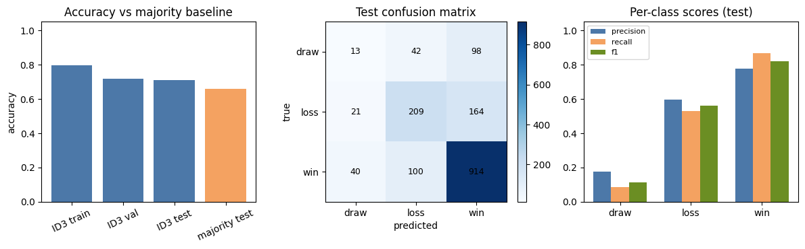

- The tree beats the baseline by 5.2 accuracy points and almost doubles macro-F1.
- `win` is learned well (recall 0.867) and `loss` moderately (recall 0.530).
- `draw` is effectively not learned: 13 of 153 draws are found, 98 are called `win` and 42 `loss`, and when the tree does say `draw` it is right only 18% of the time.
- The largest single error is `loss` predicted as `win` (164 boards).

#### 2.3.4 Scale check on the full dataset (same frozen stops)

The full table was split 60/20/20 (train 40,533 / val 13,512 / test 13,512) and the tree refit with `max_depth = 8`, `min_samples_leaf = 20`, without retuning.

| | Subsample tree | Full-data tree |
|---|---|---|
| Training rows | 4,799 | 40,533 |
| Nodes / root | 668 / `d1` | 2,961 / `a1` |
| Fit time | ≈ 24 s (extrapolated from Probe 3) | 105 s |
| Train / val / test accuracy | 0.795 / 0.718 / 0.710 | 0.791 / 0.743 / **0.753** |
| Train–test gap | 0.085 | 0.038 |
| Test macro-F1 | 0.498 | **0.543** |
| Majority baseline (test acc / macro-F1) | 0.658 / 0.265 | 0.658 / 0.265 |
| `draw` recall / `loss` recall / `win` recall | 0.085 / 0.530 / 0.867 | 0.105 / 0.591 / 0.907 |

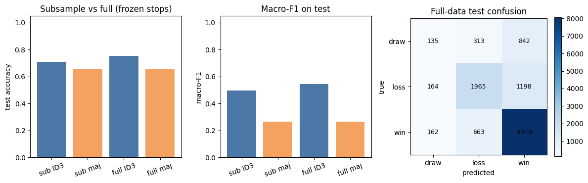

With 8.4 times more data the same depth budget supports a tree 4.4 times larger, the generalisation gap halves and test accuracy rises by 4.3 points. The `draw` class barely improves (recall 0.105; 842 of 1,290 draws predicted `win`). The root attribute also changes from `d1` to `a1`: the gains of the top candidate cells are so close that the sample decides which one wins, which is the instability expected of greedy trees.

#### 2.3.5 Reference comparison with scikit-learn

`DecisionTreeClassifier(criterion="entropy", max_depth=8, min_samples_leaf=20)` was fitted on the same training boards after encoding `b → 0, o → 1, x → 2`.

| Model | Test accuracy | Test macro-F1 |
|---|---|---|
| **ID3 (ours)** | **0.710** | **0.498** |
| scikit-learn entropy tree | 0.681 | 0.438 |
| Majority baseline | 0.658 | 0.265 |

The two models disagree on **27.5%** of test boards (441 of 1,601). By true class the disagreements are 217 `win` (21% of `win` boards), 157 `loss` (40%) and 67 `draw` (44%): they differ most on the minority classes, where both are weakest.

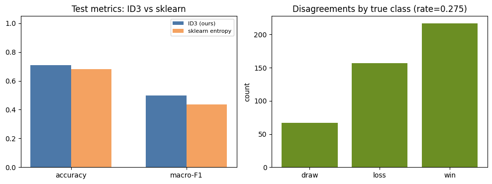

The FAQ asks for the residual gap to be explained. "Same depth and minimum leaf size" does not mean the same hypothesis space:

1. **Multiway vs binary splits.** A depth-8 ID3 tree can have up to $3^8 = 6{,}561$ leaves; a depth-8 binary tree at most $2^8 = 256$. Matching depth gives scikit-learn far less capacity, and our tree already uses 668 nodes.
2. **Ordinal encoding.** With integer codes a threshold can only separate `{b} | {o, x}` or `{b, o} | {x}`. Isolating the second player's discs (`o` against `{b, x}`) needs two splits on the same cell, which costs depth.
3. **Attribute reuse.** CART may test a cell again further down a path to finish separating its three values; ID3 does it in one node and then removes the cell.
4. **`min_samples_leaf` semantics.** scikit-learn guarantees every leaf has at least 20 samples. Our rule only stops splitting nodes with fewer than 20 rows, so our children can be smaller. Our tree is therefore less constrained at the same nominal setting.
5. **Tie-breaking.** scikit-learn randomly permutes features before searching (seeded); our `best_split` takes the first attribute in column order.

Points 1, 2 and 4 all give scikit-learn a more restricted $H$ at the "matched" settings, which is consistent with its lower accuracy. This is not evidence that our implementation is better, only that the two hyperparameter settings are not comparable. A fairer comparison would match the number of leaves or tune each model on validation separately.

#### 2.3.6 Probes: predict, break, check

Each probe follows the FAQ pattern: write the prediction first, run it, then reconcile.

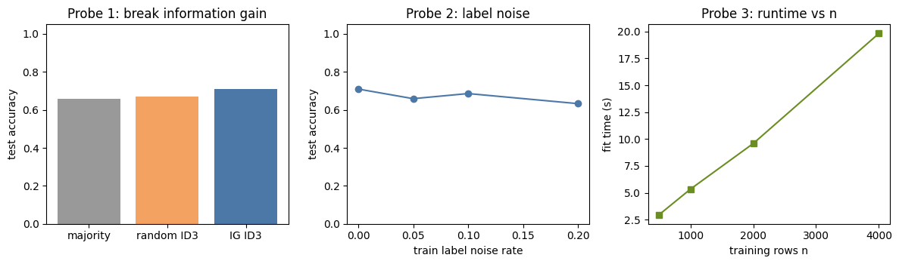

**Probe 1: break information gain (random attribute at every node).**

- *Prediction:* without gain-based selection, splits carry no targeted information, so accuracy should fall to about the majority baseline (0.658).
- *Observed:* random-split tree 0.671; ID3 0.710; majority 0.658.
- *Reconciliation:* the collapse happened, but only partly. Random trees still partition the data into depth-8 cells whose leaves take majority labels, and some random cells (bottom-row and centre cells) are informative by chance. More importantly, the gain of the **best** cell at the root is only 0.026 bits, so the gap between the best and a random attribute is small at every node. Greedy selection is worth 3.9 accuracy points here, which says as much about how weak single-cell attributes are as about ID3.

**Probe 2a: constant (zero-information) feature.**

- *Prediction:* a column that is `b` on every row splits $S$ into a single child equal to $S$, so $H(S \mid A) = H(S)$ and $IG = 0$ exactly.
- *Observed:* `IG(S, const) = 0.000000`.
- *Reconciliation:* matches. Such a column can never be chosen over an informative one, and if it were the only candidate the `ig <= 0` stop would make the node a leaf.

**Probe 2b: label noise on the training set (test labels untouched).**

| noise rate | 0.00 | 0.05 | 0.10 | 0.20 |
|---|---|---|---|---|
| test accuracy | 0.710 | 0.659 | 0.686 | 0.633 |

- *Prediction:* accuracy should fall steadily as noise grows, because leaves start fitting flipped labels.
- *Observed:* accuracy falls overall (−7.7 points at 20%), but not monotonically: 5% noise is worse than 10%. At 20% noise the tree (0.633) is **below** the majority baseline.
- *Reconciliation:* each noise level is a single random draw. The standard error of an accuracy near 0.7 on 1,601 boards is about 0.011, so the 0.027 inversion is about 2.4 standard errors, which is larger than test sampling noise alone. The rest is model variance: gains at the top of the tree differ by hundredths of a bit (Probe 1, root change in §2.3.4), so flipping 5% of labels can change the root and therefore the whole tree. A proper version of this probe needs several seeds per noise level (§2.4.4). Falling below the baseline at 20% shows the depth-8 tree fitting noise rather than falling back to the safe majority answer.

**Probe 3: runtime versus training size.**

- *Prediction (cost model):* at a node with $n_v$ rows and $k$ remaining attributes, `best_split` computes $k$ gains, each a `groupby` over $n_v$ rows: $O(n_v \cdot k)$ with a constant factor for $C = 3$ classes. Nodes at the same depth partition the training set, so each level costs $O(n \cdot d)$ and a tree of depth $D$ costs $O(D \cdot n \cdot d)$. With $D$ and $d$ fixed, fit time should be linear in $n$.
- *Observed:* $n$ = 500, 1,000, 2,000, 4,000 took 2.96, 5.34, 9.58, 19.82 s. An 8-fold increase in $n$ gave a 6.7-fold increase in time, close to linear (about 4.8 s per 1,000 rows plus about 0.5 s overhead).
- *Reconciliation and where it breaks:* extrapolating the line to the full 40,533 rows predicts about 196 s, but the full fit took 105 s. The $O(n)$ row work is not what dominates in this implementation: each gain evaluation is a pandas `groupby` with a large fixed per-call overhead, so time tracks **the number of gain evaluations** (internal nodes × remaining attributes) rather than rows. That is consistent with the numbers: the full-data tree has 4.4 times as many nodes as the subsample tree (2,961 vs 668), and took about 4.4 times as long (105 s vs about 24 s). On small samples the node count grows roughly in proportion to $n$, which is why Probe 3 looked linear. The dependence on $d$ was not measured.

**Probe 4: unseen category at prediction time.**

- *Prediction:* when a board has a value that was never observed at a node, `predict_one` cannot find a child and should return that node's majority class.
- *Observed:* setting `a1 = "Z"` on a test board returned `win`.
- *Reconciliation:* the probe is **inconclusive as written**. The frozen tree's root is `d1`, not `a1`, so the corrupted cell is only tested if the board's path happens to reach an `a1` node; `win` may simply be the normal prediction. The same applies to the deployment demo (`d4 = "?"`, prediction unchanged). A conclusive version corrupts the root cell: by construction every board with an unseen `d1` value returns the root's `default`, the training majority `win`, so an out-of-vocabulary value at the root reduces the model to the majority baseline. The policy fails silently, which §2.4.3 treats as a deployment limitation.

#### 2.3.7 Deployment demo

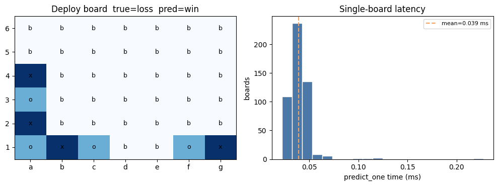

A held-out board (4 `x`, 4 `o`, discs in columns a, b, c, f, g) has true value `loss`; the tree predicts `win`, an example of the most common error class. Over 500 single-board calls, `predict_one` takes 0.039 ms on average (95th percentile 0.051 ms), several orders of magnitude inside any interactive budget. Prediction cost is at most 8 dictionary lookups, independent of the training size.

### 2.4 Discussion (Criterion C)

#### 2.4.1 Expected behaviour vs actual output

**Expected behaviour.** Given a legal 8-ply board, the ideal model outputs its solved value, and the ideal comparison is exact: 0–1 agreement between the predicted label and the database label, board by board, with every class mattering. Because the labels are exact (computed by search, not annotated), any disagreement is a model error, not label noise.

**Where the ideal comparison is used.** It is used at **validation** (to choose the stopping rules) and **test** (one-shot evaluation), in both cases as accuracy plus per-class scores. It is **not** used during training: each split is chosen by information gain. The reason is structural. 0–1 error is flat for most candidate splits: a split that makes children purer but leaves every child's majority label unchanged does not change the number of errors at all, so a greedy search driven by accuracy stalls on plateaus. Entropy is strictly sensitive to any change in the class mix, so it always gives a direction.

**Actual behaviour.** The frozen tree behaves like a good `win` detector with a reasonable `loss` detector and almost no `draw` detector. Leaves are frequently impure: the first leaf in the exported tree has 31 boards and entropy 1.29 bits (close to the maximum 1.585) yet outputs the single label `win`. The depth cap stops the tree while leaves still contain a mixture, and the majority vote hides that mixture from the user.

#### 2.4.2 Loss function vs task objective

| | Training criterion | Task objective |
|---|---|---|
| What | Information gain at each node (local, greedy) | Correct solved value per board, for every class |
| Scope | One node at a time; no global loss for the tree | Whole held-out set |
| Weighting | Each sample counts once, so classes count in proportion to their frequency | Macro-F1 gives each class equal weight |
| Used in | `best_split` | Validation selection and test evaluation |

**Concrete example where the criterion improves but the objective does not.** Take a node with 100 boards: 60 `win`, 30 `loss`, 10 `draw` ($H = 1.295$). Splitting it into child A with (30, 10, 10) and child B with (30, 20, 0) gives $H(A) = 1.371$, $H(B) = 0.971$, remainder 1.171 and **$IG = 0.124 > 0$**. Both children still predict `win`, so 0–1 accuracy stays exactly 60% and draw recall stays 0. ID3 takes this split and spends one level of the depth budget on it. The frozen tree contains real instances: the `a2` node at depth 7 in the Appendix excerpt has $IG = 0.093$, yet all three of its children predict `win`, so that split changes no prediction at all. On Connect-4, where single cells carry little information (root gain 0.026 bits), splits like this are common.

**The observed consequence: the `draw` class.** Draws are 9.5% of boards. For a leaf to output `draw`, draws must be the plurality inside it, which requires a conjunction of cell tests that isolates draw positions. Information gain has little incentive to find such a conjunction: separating `win` from `loss` removes far more weighted entropy because those classes hold 90% of the mass. The result is a draw recall of 0.085 on the subsample and 0.105 on the full data, even though accuracy is well above the baseline.

**Monitoring and mitigation.**

- **Monitor:** report per-class recall and macro-F1 on the validation set for every grid point, not only accuracy. Here, selecting by accuracy picked the larger tree on a one-board margin without checking whether `draw` improved.
- **Select by the objective:** use validation macro-F1 as the selection metric, so hyperparameters are chosen for balanced performance.
- **Change the criterion:** class-weighted entropy (count each sample with weight $1/\text{freq}(c)$ when computing $p_c$) makes a pure `draw` subset worth as much entropy reduction as a pure `win` subset. In the code this is a change to the `value_counts` line in `entropy` only.
- **Change the leaf rule:** store class counts at each leaf and predict `draw` when its share passes a threshold chosen on validation, trading `win` precision for `draw` recall.

#### 2.4.3 Implications and limitations

**Answer to the research question.** Greedy information-gain splitting on raw cells recovers the solved value clearly better than the majority rule (0.710 vs 0.658 on the subsample, 0.753 vs 0.658 on the full data) and better than a depth-matched binary entropy tree, but it does not learn the minority `draw` class: that class is sacrificed because the criterion weights classes by frequency.

**Connecting results to theory.**

- *Capacity vs sample size.* The subsample tree has about 7 training rows per node (4,799 / 668); the full-data tree about 14 (40,533 / 2,961). The generalisation gap halves (0.085 to 0.038) as the number of samples per unit of model complexity doubles, which is the behaviour expected when the effective size of $H$ is fixed by the depth cap while $n$ grows.
- *Greedy search in a complete $H$.* $H$ can represent the true value function, so the errors are not caused by the hypothesis space being too small in principle. They come from the search (greedy, one cell at a time, no look-ahead) and the regularisation (depth 8). Probe 1 shows that the greedy choice is only worth about 4 points over random choice, because no single cell is very informative.
- *Instability.* The root changes between subsample and full data (`d1` vs `a1`), and 5% label noise changes accuracy more than 10% noise. Both are signs of a high-variance learner whose top-level decisions rest on tiny gain differences.

**Limitations.**

1. **Flat attributes.** The 42 cells are treated as unrelated variables. Connect-4 value depends on lines of four, threats and column parity, which ID3 can only express as long chains of single-cell tests.
2. **Single seed.** All metrics are point estimates from one split. The FAQ asks for spread across seeds; the one-board validation tie and the non-monotonic noise curve both show why this matters.
3. **Tuning on the subsample.** Stopping rules chosen on 4,799 rows were reused for 40,533 rows without retuning. Deeper trees may be better at full scale.
4. **`min_samples_leaf` is really "minimum samples to split".** The name suggests the scikit-learn meaning, which it does not implement, and this weakens the "matched settings" comparison.
5. **Silent failure on invalid input.** An unseen value returns a majority label with no warning, and at the root that means always `win`. Board legality (ply count, gravity) is not checked.
6. **Selection rule.** With a one-board margin, the larger tree was chosen; a one-standard-error rule would prefer the 420-node depth-6 tree.
7. **Implementation speed.** Pure pandas `groupby` dominates the fit time (Probe 3), which is what forced the subsample.

#### 2.4.4 Potential improvements and future work

Each item is tied to a failure observed above rather than to "more data":

| Observed failure | Proposed change | Expected effect |
|---|---|---|
| `draw` recall ≈ 0.09 (§2.3.3) | Class-weighted entropy; select stops by validation macro-F1; thresholded leaf rule | Trade some `win` precision for `draw` recall; measurable on validation |
| Single cells carry ≤ 0.03 bits at the root (Probe 1) | Engineered attributes: number of open three-in-a-rows per player, centre-column control, column parity | Fewer, more informative splits; shallower and more readable trees |
| Over-fitting at depth 8, below-baseline under 20% noise (§2.3.2, Probe 2b) | Post-pruning (reduced-error pruning on validation, or C4.5's pessimistic pruning) instead of only pre-pruning | Remove splits that do not help held-out accuracy, including noise-fitting ones |
| Non-monotonic noise curve, one-board validation tie | Repeat splits and noise draws over 5–10 seeds; report mean ± standard deviation; one-standard-error selection rule | Conclusions that survive resampling |
| Unfair "matched depth" comparison (§2.3.5) | Match leaf count, or tune both models independently on validation; also compare a one-hot-encoded scikit-learn tree | A comparison of algorithms rather than of hyperparameter meanings |
| Silent out-of-vocabulary fallback (Probe 4) | Validate input against `{x, o, b}` and the 8-ply legality rules before traversal; reject or flag | Loud failure instead of a hidden baseline answer |
| Fit time dominated by per-node pandas overhead (Probe 3) | Encode cells as `int8` arrays and count with `np.bincount` per attribute | Full-data tuning becomes practical, removing limitation 3 |

Ensembles (bagging, random forests) would reduce the variance seen in the root instability and noise probe, but at the cost of the single readable tree that motivated ID3; they are better treated as a comparison point than a replacement.

---

## 3. Implementation Log

*[Review this section and rewrite it in your own words. It must describe what you actually did, and you must be able to defend every point in the Q&A.]*

### 3.1 Challenges and solutions

| Challenge | What went wrong / why it was hard | Solution |
|---|---|---|
| **Multiway splits on categorical data** | Most tutorials and scikit-learn use binary threshold splits on numbers. Encoding `{x, o, b}` as integers would impose a false order. | Kept values as strings and used `X.groupby(attr)` to create one child per observed value, storing children in a dict keyed by value. |
| **Branches missing at prediction time** | A child exists only for values seen in that node's training subset. Deep nodes often see only two of the three values, so indexing `children[value]` directly would raise a `KeyError` on some test boards. | Every internal node stores `default` (its majority class) and `predict_one` uses `children.get(...)`, returning `default` when the branch is missing. |
| **Runtime on 42 attributes** | Each node evaluates up to 42 gains, each a pandas `groupby`; a single depth-8 fit on the full training set took 105 s, and the grid needs 8 fits. | Used a stratified 8,000-row subsample for tuning and all probes, and ran the full data once as a scale check with frozen stops. Probe 3 then showed the cost is dominated by per-call overhead, not rows, which points to a vectorised fix (§2.4.4). |
| **Hand-check did not match the code** | The first version of the §4 markdown claimed IG(`g1`) ≈ 1.126 for the 12-board slice. Running the notebook gave 0.384 and the `assert` failed. Recounting the slice showed the markdown table did not describe the boards the seed actually selects (for example, `g1 = o` has 7 boards, not 4). | Recounted the partitions from the printed slice, redid the calculation by hand (remainder 1.201, IG 0.384), and corrected both the markdown and the assert. This was the most useful single check in the project: it confirmed the code, not the prose, was right. |
| **Choosing hyperparameters without touching test** | Easy to tune on test by accident when looking at plots. | Separate validation set; the grid only reads train and validation; test is scored once after freezing. |
| **Comparing with scikit-learn fairly** | Read naively, the comparison says our tree is "better" (0.710 vs 0.681), which is not a meaningful conclusion when the two hypothesis spaces differ. | Listed every difference in hypothesis space (arity, encoding, reuse, leaf-size rule, tie-breaking) and reported the comparison as "not like-for-like" (§2.3.5). |
| **Probe 4 design** | Corrupting `a1` gave a prediction, which looked like the fallback working, but `a1` is not the root. | Recognised the probe was inconclusive and described the conclusive version (corrupting the root cell `d1`). |

### 3.2 Use of AI tools

*[Edit to reflect your actual usage.]*

- **Tool:** Cursor (AI coding assistant) was used throughout.
- **Planning:** I used it to read the assignment specification and FAQ and propose a notebook outline mapped to Criteria A, B and C. I chose the dataset (Connect-4) and the algorithm (ID3).
- **Code:** It drafted the scaffolding for the notebook sections, plotting code and the first versions of `id3_train` and `predict_one`. I checked every line of the core functions against the formulas (§2.2.4) and can explain why each is there.
- **Report:** It drafted this report from the notebook's outputs, which I then reviewed and edited.

**Where I did not accept the AI output as given:**

1. **Hand-calculation numbers.** The AI-written markdown for the §4 hand-check contained numbers that did not match the data. This was only caught because the notebook asserts the hand result against the code. Lesson: AI-generated arithmetic about data it has not seen must be verified by running code.
2. **`min_samples_leaf` naming.** The parameter was named after scikit-learn's, but the implementation (`len(y) < min_samples_leaf`) is a minimum-samples-to-split rule. I kept the behaviour but documented the difference, because it affects the sklearn comparison.
3. **"sklearn comparison with matched settings".** The suggestion to match `max_depth` treats depth as capacity. For multiway vs binary trees it is not, so I rewrote the interpretation.
4. **Probe 4 conclusion.** The notebook comment says the OOV prediction comes from the "node majority fallback"; given the tree's root, that is not demonstrated by the probe as run.
5. **Validation selection.** The automatic "best validation accuracy" pick is a one-board tie. I report it as such rather than as a clear winner.

### 3.3 Knowledge gaps and how they were verified

| Component | Why it is needed | How I verified it | What I did to understand it |
|---|---|---|---|
| Entropy and information gain | Core splitting criterion | Hand calculation on the 12-board slice matched the code to 3 decimals; a constant feature gives IG = 0 exactly (Probe 2a). | Worked through Quinlan (1986) and Mitchell (1997, ch. 3); related IG to mutual information $I(Y; A)$. |
| pandas `groupby` and `value_counts` | Form partitions $S_v$ and class counts | Printed partitions for the slice and checked counts against the printed table. Confirmed `value_counts` omits absent classes, which is why no $0 \log 0$ guard is needed. | Read the pandas documentation for `groupby` iteration and `value_counts(normalize=True)`. |
| scikit-learn `DecisionTreeClassifier` internals | Reference comparison only | Not verified line by line. Relied on the documented meaning of `criterion`, `max_depth`, `min_samples_leaf` and the random feature permutation. | Read the scikit-learn user guide on trees (CART, binary splits). I do not claim to know its full implementation. |
| Why accuracy is flat for many splits | Justifies using IG instead of 0–1 loss during training | Constructed the 100-board example in §2.4.2 (IG 0.124, accuracy unchanged) by hand. | Mitchell (1997) and Breiman et al. (1984) discussion of impurity measures. |
| Standard error of accuracy | Needed to judge whether the noise-curve inversion is significant | Computed $\sqrt{p(1-p)/n} \approx 0.011$ for $p \approx 0.7$, $n = 1{,}601$. | Binomial approximation; I have not run a formal significance test, and the multi-seed repeat is listed as future work. |
| Runtime model | FAQ cost requirement | Measured 4 sizes; checked that the full-data fit time is consistent with the node count, not the row count. | Derived $O(D \cdot n \cdot d)$ per level; I have not profiled the pandas internals to confirm the per-call overhead directly. |

---

## 4. References

- Allis, L. V. (1988). *A Knowledge-Based Approach of Connect-Four: The Game Is Solved: White Wins* (Master's thesis). Vrije Universiteit, Amsterdam.
- Breiman, L., Friedman, J. H., Olshen, R. A., & Stone, C. J. (1984). *Classification and Regression Trees*. Wadsworth.
- Hunt, E. B., Marin, J., & Stone, P. J. (1966). *Experiments in Induction*. Academic Press.
- Mitchell, T. M. (1997). *Machine Learning* (Chapter 3: Decision Tree Learning). McGraw-Hill.
- Pedregosa, F., et al. (2011). Scikit-learn: Machine learning in Python. *Journal of Machine Learning Research, 12*, 2825–2830. Decision tree documentation: https://scikit-learn.org/stable/modules/tree.html
- Quinlan, J. R. (1979). Discovering rules by induction from large collections of examples. In D. Michie (Ed.), *Expert Systems in the Micro-Electronic Age* (pp. 168–201). Edinburgh University Press.
- Quinlan, J. R. (1986). Induction of decision trees. *Machine Learning, 1*(1), 81–106. https://doi.org/10.1007/BF00116251
- Quinlan, J. R. (1993). *C4.5: Programs for Machine Learning*. Morgan Kaufmann.
- Shannon, C. E. (1948). A mathematical theory of communication. *Bell System Technical Journal, 27*(3), 379–423.
- Tromp, J. (1995). Connect-4 [Dataset]. UCI Machine Learning Repository. https://doi.org/10.24432/C59P43
- UTS 32513 (2026). *A2 Specification* and *FAQ 2026* (Canvas).

---

## Appendix

### A. Excerpt of the frozen tree (`id3_frozen_tree.txt`)

The first path of the 668-node tree. Each internal node shows its sample count `n`, entropy `H`, the gain `IG` of its chosen split and its majority label; the notebook exports the full tree to `id3_frozen_tree.txt` and `id3_frozen_tree.json`.

```text
[d1]  n=4799, H=1.2185, IG=0.0262, majority=win
  |-- d1 = b
  |   [c3]  n=2094, H=1.2332, IG=0.0357, majority=win
  |     |-- c3 = b
  |     |   [c2]  n=1555, H=1.2129, IG=0.0703, majority=win
  |     |     |-- c2 = b
  |     |     |   [b2]  n=1092, H=1.2255, IG=0.0262, majority=win
  |     |     |     |-- b2 = b
  |     |     |     |   [c1]  n=496, H=1.1688, IG=0.0335, majority=win
  |     |     |     |     |-- c1 = b
  |     |     |     |     |   [e3]  n=158, H=1.2011, IG=0.0953, majority=win
  |     |     |     |     |     |-- e3 = b
  |     |     |     |     |     |   [a6]  n=120, H=1.1624, IG=0.0948, majority=win
  |     |     |     |     |     |     |-- a6 = b
  |     |     |     |     |     |     |   [a2]  n=109, H=1.1456, IG=0.0934, majority=win
  |     |     |     |     |     |     |     |-- a2 = b
  |     |     |     |     |     |     |     |   LEAF -> win  (n=31, H=1.2910)
  |     |     |     |     |     |     |     |-- a2 = o
  |     |     |     |     |     |     |     |   LEAF -> win  (n=41, H=0.5404)
  |     |     |     |     |     |     |     |-- a2 = x
  |     |     |     |     |     |     |     |   LEAF -> win  (n=37, H=1.4192)
  |     |     |     |     |     |     |-- a6 = o
  |     |     |     |     |     |     |   LEAF -> win  (n=7, H=-0.0000)
  |     |     |     |     |     |     |-- a6 = x
  |     |     |     |     |     |     |   LEAF -> loss  (n=4, H=0.8113)
  |     |     |     |     |     |-- e3 = o
  |     |     |     |     |     |   LEAF -> loss  (n=19, H=1.5574)
  |     |     |     |     |     |-- e3 = x
  |     |     |     |     |     |   LEAF -> win  (n=19, H=0.2975)
```

What the excerpt shows:

- **Tiny gains everywhere:** every split on this path gains less than 0.1 bits.
- **A split that changes nothing:** the `a2` node has gain 0.093, but all three children predict `win` (§2.4.2).
- **Impure leaves:** the `a2 = x` leaf outputs `win` with entropy 1.42 bits, close to the 3-class maximum of 1.585.
- **Leaves smaller than `min_samples_leaf = 20`:** `a6 = x` has 4 boards and `a6 = o` has 7, confirming that the rule stops splitting small nodes but does not bound leaf size (§2.2.4, §2.4.3).
- **The first path follows empty cells:** `d1 = b`, `c3 = b`, `c2 = b`, … The tree first asks which cells are **not** played, which is the flat-attribute limitation in action.

### B. Mini-slice tree used as a sanity check

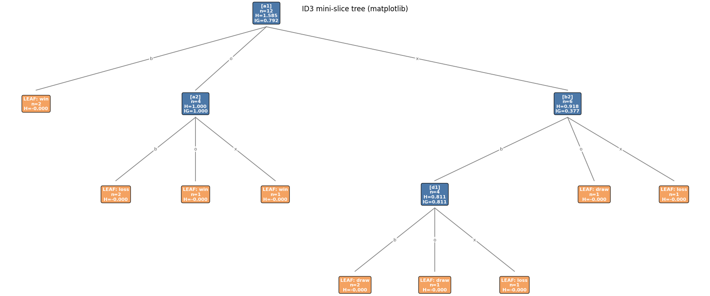

### C. Additional figures

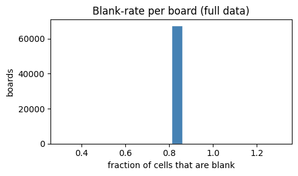

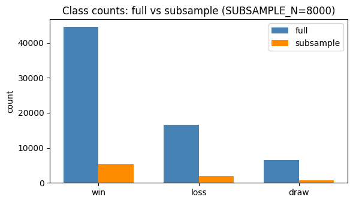

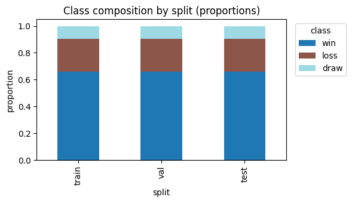

### D. Submission checklist

- [ ] Fill in name and student ID (front matter and notebook §0).
- [ ] Publish the Colab notebook publicly and paste the plain-text URL into Section 1 and notebook §13.
- [ ] Runtime → Run all on a fresh Colab session succeeds (the §4 assertion now matches the data).
- [ ] Rewrite Section 3 (Implementation Log) in your own words.
- [ ] Export to PDF as `STUDENTNAME_STUDENTID_2026_UTS_ML_Journal.pdf`, with the `figures/` folder alongside `report.md` so images render.
